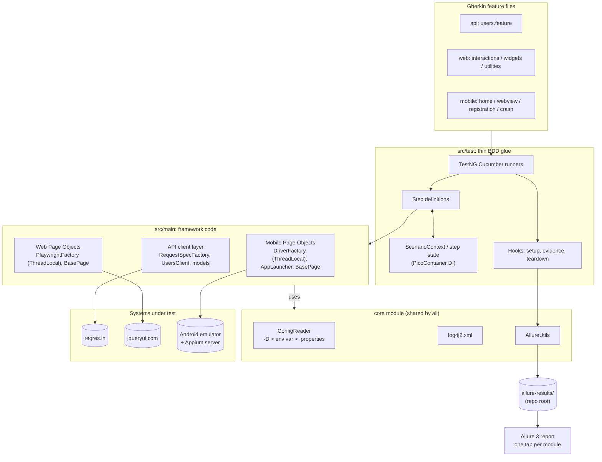

# SDET Evaluation Framework

[](https://github.com/alaasayedrashed/sdet-evaluation/actions/workflows/api-web-tests.yml)
[](https://github.com/alaasayedrashed/sdet-evaluation/actions/workflows/mobile-tests.yml)
[](https://github.com/alaasayedrashed/sdet-evaluation/actions/workflows/allure-report.yml)

**Live Allure report (latest `main`):** https://alaasayedrashed.github.io/sdet-evaluation/. This is the easiest way to view the results; nothing to download or install.

One Maven multi-module repository that automates three kinds of testing with the same stack
(Cucumber BDD on TestNG, Allure reporting, SLF4J/Log4j2 logging):

| Module | Tool | Application under test | Scenarios |
|---|---|---|---|
| `api-tests` | REST Assured | [reqres.in](https://reqres.in) | 2 (GET + chained POST) |
| `web-tests` | Playwright for Java | [jqueryui.com](https://jqueryui.com) | 7 |
| `mobile-tests` | Appium (UiAutomator2) | `selendroid-test-app` on an Android emulator | 9 (scenarios 8 and 9 fail by design) |
| `core` | - | shared code used by all modules: configuration, Allure helpers, logging config | - |

---

## Contents

1. [Tech stack](#tech-stack)
2. [Architecture](#architecture)
3. [Prerequisites](#prerequisites)
4. [Running the tests](#running-the-tests)
5. [Parallel runs](#parallel-runs)
6. [Docker](#docker)
7. [Code style](#code-style)
8. [Reporting](#reporting)
9. [CI/CD](#cicd)
10. [Scenario coverage](#scenario-coverage)
11. [Assumptions and notes](#assumptions-and-notes)
12. [Design decisions](#design-decisions)
13. [Java features used](#java-features-used)
14. [Requirements → evidence](#requirements--evidence)
15. [What I would add next](#what-i-would-add-next)

---

## Tech stack

All versions are managed once in the parent [`pom.xml`](pom.xml) (`<properties>` + `<dependencyManagement>` / `<pluginManagement>`); child POMs declare dependencies without versions.

| Area | Library / tool | Version |
|---|---|---|
| Language | Java (Temurin) | **25 LTS** |
| Build | Maven (via wrapper `./mvnw`) | 3.10.0 |
| Test runner | TestNG | 7.12.0 |
| BDD | Cucumber (`cucumber-java`, `-testng`, `-picocontainer`) | 7.34.9 |
| Mobile | Appium java-client / Selenium | 10.1.1 / 4.50.0 |
| Mobile server | Appium server / UiAutomator2 driver | 3.8.0 / 8.7.0 |
| Web | Playwright for Java | 1.63.0 |
| API | REST Assured + json-schema-validator | 6.0.1 |
| JSON | Jackson | 2.22.3 |
| Assertions | AssertJ | 3.27.7 |
| Reporting | Allure Java (`allure-cucumber7-jvm`, `allure-rest-assured`) | 3.0.0 |
| Report generator | Allure 3, run by the `allure-maven` plugin | 3.20.1 (plugin 3.1.0) |
| Logging | SLF4J / Log4j2 | 2.0.20 / 2.26.1 |
| Boilerplate | Lombok | 1.18.48 |
| Step capture | AspectJ weaver (`-javaagent`) | 1.9.25.1 |
| Formatting | Spotless + google-java-format | 3.10.3 / 1.36.0 |
| Static checks | Checkstyle (`maven-checkstyle-plugin`) | 14.3.0 (plugin 3.6.0) |

Why Cucumber **7** and not 8: Allure has no Cucumber 8 adapter yet (only `allure-cucumber7-jvm`).

---

## Architecture



### Repository layout

```
sdet-evaluation/
├── pom.xml                  parent: modules, versions, enforcer, surefire + AspectJ agent, allure-maven
├── allurerc.mjs             Allure 3 report config: per-module environments, categories, variables
├── config/checkstyle.xml    small Checkstyle rule set (see Code style)
├── .editorconfig            editor settings matching the formatter
├── Dockerfile               web + API runner on the official Playwright Java image
├── docker-compose.yml       one-command run: docker compose run --rm web-api
├── .env.example             optional settings for the Docker run (copy to .env)
├── core/                    ConfigReader, AllureUtils, DateUtils, FileUtils, log4j2.xml
├── api-tests/               client/ (RequestSpecFactory, UsersClient), models/ (POJOs + record)
├── web-tests/               driver/ (PlaywrightFactory), pages/ (+ components/RentalCarForm)
├── mobile-tests/            driver/ (DriverFactory, AppLauncher, ScreenCapture), pages/, models/
│   └── src/test/resources/apps/selendroid-test-app.apk
└── .github/
    ├── workflows/           lint.yml, api-web-tests.yml, mobile-tests.yml, allure-report.yml
    └── scripts/             run-mobile-tests.sh
```

Every test module follows the same layout: framework code (drivers, page objects, clients, models, config) in `src/main`, and BDD glue (runners, steps, hooks, features, `config/*.properties`) in `src/test`.

### Patterns and why they are used

| Pattern | Where | Why |
|---|---|---|
| **Page Object Model** | `web-tests/.../pages`, `mobile-tests/.../pages` | Locators and interactions live in one class per screen; step definitions stay readable and never touch locators. |
| **Component object** | `web-tests/.../pages/components/RentalCarForm` | The Controlgroup demo shows the same form twice (horizontal + vertical); one component serves both. |
| **API client layer + POJOs** | `api-tests/.../client`, `.../models` | Steps call `usersClient.getUsers(2)` instead of building requests; JSON maps to typed models. |
| **Factory + `ThreadLocal`** | `PlaywrightFactory`, `DriverFactory` | Each thread owns its browser/driver, which is what makes the [parallel web/API runs](#parallel-runs) safe. |
| **Dependency injection (PicoContainer)** | step and hook constructors | Page objects, clients and `ScenarioContext` are injected per scenario, with no static mutable state. |
| **`ScenarioContext` (API chaining)** | `api-tests/.../context/ScenarioContext` | Carries the GET response and the selected user into the POST step, with typed fields. |
| **Layered configuration** | `core/.../config/ConfigReader` | No hardcoded URLs, credentials, timeouts or devices. Each key is resolved in the order `-Dkey` → environment variable (`WEB_HEADLESS`) → `config/<module>.properties`. |
| **Hooks for evidence** | `ApiHooks`, `WebHooks`, `MobileHooks` | Setup/teardown and failure evidence (screenshots, page source/HTML, logcat, traces) are kept out of the steps. |
| **Builder** | `CreateUserRequest` (Lombok `@Builder` on a record) | The POST body is built from the GET response, not by string concatenation. |

### Waits and stability

- **Explicit waits only.** There is no `Thread.sleep` in the codebase.
  - Web: Playwright's auto-waiting with configured timeouts.
  - Mobile: `WebDriverWait` / `FluentWait`, for example an *invisibility* wait for the progress loader and a 100 ms polling wait for the short-lived toast.
- **Assertions** use AssertJ with descriptive messages (`.as("...")`). The Controlgroup forms use soft assertions, so all fields are checked at once.
- **Exception handling.** Evidence capture never throws: every screenshot, page source or logcat capture is isolated in its own `try/catch`. Configuration errors fail fast with a message that names the missing key and how to set it.
- **Clean shutdown.** After the mobile run the app is closed and the Appium session ended, so nothing is left running on the emulator.

---

## Prerequisites

| Needed for | Requirement |
|---|---|
| Everything | **JDK 25**: the latest LTS, supported by every library in the stack. The enforcer stops the build with a clear message on an older JDK; `.java-version` pins 25. |
| Everything | **No Maven install needed**: use the bundled wrapper `./mvnw` (Windows: `mvnw.cmd`). |
| Report | Nothing extra. The `allure-maven` plugin downloads the Allure 3 generator (and its own Node.js) into `.allure/` on first use. |
| Web | Nothing extra. Playwright downloads its browsers on first run. |
| Mobile | **Node.js 22** and **Appium server 3.8.0** + **UiAutomator2 driver 8.7.0**: `npm i -g appium@3.8.0 && appium driver install uiautomator2@8.7.0` |
| Mobile | **Android SDK** with `ANDROID_HOME` set, and **one** emulator on **API 30 (Android 11)**, x86_64. See [old-app caveats](#mobile-selendroid-test-app). |

No JDK at all? Run web + API through [Docker](#docker) instead.

<details>
<summary>Mobile setup checklist (one-time)</summary>

1. Install the Android SDK (Android Studio or `cmdline-tools`) and set `ANDROID_HOME` (Windows: `%LOCALAPPDATA%\Android\Sdk`).
2. Install the API 30 image and create an AVD:
   ```bash
   sdkmanager "system-images;android-30;google_apis;x86_64"
   avdmanager create avd -n sdet_api30 -k "system-images;android-30;google_apis;x86_64" -d pixel_5
   emulator -avd sdet_api30
   ```
   (CI uses the lighter `aosp_atd` image of the same API level; either works.)
3. Install Appium and the driver (versions above), then start the server with chromedriver autodownload (needed for the WebView scenario):
   ```bash
   appium --allow-insecure "*:chromedriver_autodownload"
   ```
4. Check that the device is visible with `adb devices`. If more than one device is connected, pick one with `-Dmobile.udid=emulator-5554`.

The APK is committed at `mobile-tests/src/test/resources/apps/` and installed by Appium on the first session.
</details>

---

## Running the tests

```bash
# Everything: API + web + mobile (mobile needs Appium + an emulator)
./mvnw clean test

# Everything except mobile (no Android tooling needed)
./mvnw clean test -pl '!mobile-tests'

# One module (-am also builds core)
./mvnw clean test -pl api-tests -am
./mvnw clean test -pl web-tests -am
./mvnw clean test -pl mobile-tests -am

# By tag (overrides each runner's default tag filter)
./mvnw test -Dcucumber.filter.tags="@smoke"
./mvnw test -pl web-tests -am -Dcucumber.filter.tags="@web_case4"
./mvnw test -pl mobile-tests -am -Dcucumber.filter.tags="@mobile_sc3"

# Mobile intentional failures (scenarios 8 and 9) - expected to fail
./mvnw test -pl mobile-tests -am -Dcucumber.filter.tags="@negative"
# All 9 mobile scenarios in one run
./mvnw test -pl mobile-tests -am -Dcucumber.filter.tags="@mobile"
```

Then build the report with `./mvnw -N allure:serve` (see [Reporting](#reporting)).

### Useful overrides

Every key in `config/*.properties` can be overridden with `-D` or an environment variable (dots → underscores, upper-case):

| Purpose | Example |
|---|---|
| Watch the browser (headed, slowed down) | `-Dweb.headless=false -Dweb.slow.mo=500ms` |
| Another browser | `-Dweb.browser=firefox` (chromium, firefox, webkit) |
| Parallel threads for web/API | `-Dthreads=2` (default 4, `1` = sequential) |
| Pick a device | `-Dmobile.udid=emulator-5554` or `MOBILE_UDID=emulator-5554` |
| Remote Appium server | `-Dmobile.appium.url=http://host:4723` |
| Send requests without the API key | `-Dapi.key.enabled=false` |

### Tags

| Tag | Meaning |
|---|---|
| `@api` `@web` `@mobile` | Module; each runner's default filter |
| `@smoke` | Fast critical path: 2 scenarios per module |
| `@negative` | Mobile scenarios 8 and 9, which fail by design; excluded from the default mobile run |
| `@api_case1..2`, `@web_case1..7`, `@mobile_sc1..9` | One tag per task scenario |
| `@screenshots` | Take a screenshot after every step (used on 4 key flows) |

---

## Parallel runs

Web and API scenarios run **in parallel, 4 threads by default**. Each runner overrides TestNG's `scenarios()` data provider with `parallel = true`, and the parent POM passes the thread count to TestNG as `testng.dataProviderThreadCount=${threads}`.

```bash
./mvnw test -pl web-tests -am                 # 4 threads (default)
./mvnw test -pl web-tests -am -Dthreads=2     # 2 threads
./mvnw test -pl web-tests -am -Dthreads=1     # sequential
```

- **Why it is safe:** every scenario gets its own Playwright browser/context and its own REST Assured request spec (`ThreadLocal` factories, per-scenario PicoContainer objects); there is no shared mutable state.
- **Measured locally:** the 7 web scenarios take about 25–30 s sequentially and about 15–18 s with 4 threads. The API suite has only 2 scenarios, so it gains little.
- **Mobile stays sequential** on **one emulator**: the scenarios share one device and one app, so they run one after another (one Appium session, app relaunched before each scenario).

---

## Docker

Web + API can run without installing Java, Maven or browsers:

```bash
docker compose run --rm web-api
./mvnw -N allure:serve          # optional: open the report (needs a JDK on the host)
```

- **Image:** the [`Dockerfile`](Dockerfile) is just the official `mcr.microsoft.com/playwright/java:v1.63.0-noble` image, which already contains a JDK, Maven and the browsers, so nothing is installed at build time. CI runs the API & Web job in the same image.
- **Mounts:** [`docker-compose.yml`](docker-compose.yml) mounts the repository, so `allure-results/` and the module `target/` folders land on the host. A named volume caches the Maven repository, so later runs are faster (about 80 s for the first run, about 50 s after that, measured locally).
- **Settings:** optional overrides go in a `.env` file (git-ignored); see [`.env.example`](.env.example). Any key from `config/*.properties` can be set there as an environment variable, e.g. `API_KEY=...` or `WEB_BROWSER=firefox`.
- **Notes:**
  - The image already ships **JDK 25** (Ubuntu's OpenJDK build), the project's Java version, so no JDK is installed on top of it.
  - On Linux, files the container writes through the bind mount (`allure-results/`, `target/`) are owned by `root`; delete them with `sudo` if needed.
  - **Mobile is not containerised.** An Android emulator in Docker needs KVM, which only Linux hosts provide (Docker Desktop on Windows/macOS has none). Mobile runs on a local emulator, and in CI on GitHub's KVM-enabled runners.

---

## Code style

```bash
./mvnw spotless:apply     # format everything
./mvnw spotless:check     # fail if anything is not formatted (CI runs this)
```

- **Formatting:** [Spotless](https://github.com/diffplug/spotless) with **google-java-format** (2-space indentation) for Java; Markdown, YAML, feature and properties files get trailing whitespace trimmed and a final newline. [`.editorconfig`](.editorconfig) gives editors the same settings.
- **Checkstyle:** a small rule set in [`config/checkstyle.xml`](config/checkstyle.xml): naming conventions, unused/star imports, empty catch blocks, no `System.out`/`System.err` (use the logger) and no `Thread.sleep` (use explicit waits). Layout rules are left to the formatter. It runs in Maven's `validate` phase, so every build fails on a violation; `./mvnw checkstyle:check` runs it alone.
- google-java-format is pinned to 1.36.0: 1.37.0 fails inside the current Spotless plugin (3.10.3).

---

## Reporting

Every module writes Allure results to **one** folder at the repository root (`./allure-results`), so the report is combined automatically.

```bash
./mvnw -N allure:report     # builds ./allure-report
./mvnw -N allure:serve      # builds it and opens it in the browser
./mvnw -N allure:report -Dallure.single.file=true   # one self-contained allure-report/index.html
```

**Ways to view a report, easiest first:**

1. **The live report on GitHub Pages:** https://alaasayedrashed.github.io/sdet-evaluation/. Always the latest `main` run, with API, web and mobile merged.
2. **The CI artifact:** each test run uploads `allure-report-api-web` / `allure-report-mobile`. Each is a **single `index.html`**: unzip it and double-click; no server needed.
3. **Locally:** `./mvnw -N allure:serve` after a test run.

What the report contains:

- **One tab ("environment") per module**: `api`, `web`, `mobile`. Tests are routed by their Cucumber tag in [`allurerc.mjs`](allurerc.mjs).
- **Failure categories**:
  - *Intentional failures (app crash demo)*
  - *Product defects (assertion failed)*
  - *Test or environment errors* (timeouts, driver, network)
- **Variables**: test stack, branch, commit, and a link to the CI run.
- **Evidence**:

  | Module | Every scenario | On failure |
  |---|---|---|
  | API | each request/response as an HTTP exchange (`AllureRestAssured` filter) | last response status and body |
  | Web | final full-page screenshot | screenshot, URL, page HTML, Playwright trace zip (open at [trace.playwright.dev](https://trace.playwright.dev)) |
  | Mobile | final device screenshot | screenshot, app state, page source, last 200 logcat lines |

  Page-object methods annotated with `@Step` appear as nested steps (AspectJ weaving), so a Cucumber step expands into the actions it performed.

  **Where to find failure evidence:** open the failed test's **Attachments** tab, or the failed step in the test body. The failure evidence is attached in an `@AfterStep` hook, so it belongs to the test itself. Attachments made in `@After` hooks (the final screenshot on success, the Playwright trace) are listed under the collapsed **Tear down** section. If a mobile session is dead after a crash, a "Failure screenshot unavailable" text with the error is attached instead of the image.

The report's title shows "Allure": the `allure-maven` plugin has no option for the report name.

### Screenshots

> _Placeholders: add the images under `docs/images/` and replace these lines._

- `docs/images/allure-overview.png`: overview with the three module tabs
- `docs/images/allure-api-chaining.png`: API chaining scenario with the HTTP exchanges
- `docs/images/allure-web-sortable.png`: web scenario with step screenshots
- `docs/images/allure-mobile-crash.png`: intentional failure with screenshot, page source and logcat

---

## CI/CD

| Workflow | Trigger | What it does |
|---|---|---|
| [`lint.yml`](.github/workflows/lint.yml) | called first by both test workflows | `spotless:check` + `checkstyle:check` on Temurin 25 (well under a minute). The test jobs run only if it passes. |
| [`api-web-tests.yml`](.github/workflows/api-web-tests.yml) | push, pull request, manual | Runs inside the official Playwright Java image (Maven and browsers preinstalled) with Temurin 25 from `setup-java`, like the other workflows, and a Maven cache. Headless API + web tests, 4 threads. Always uploads `allure-results` and a single-file HTML report; uploads traces and logs on failure. About 2 min. |
| [`mobile-tests.yml`](.github/workflows/mobile-tests.yml) | push, pull request, manual | KVM-enabled Ubuntu, one API 30 **ATD** emulator (Google's headless "Automated Test Device" image, 4 cores, clean boot each run), Appium 3.8.0 + UiAutomator2 8.7.0, then runs [`run-mobile-tests.sh`](.github/scripts/run-mobile-tests.sh). Always uploads results, a single-file HTML report, the Appium log and framework logs. About 4 min. |
| [`allure-report.yml`](.github/workflows/allure-report.yml) | after either test workflow finishes on `main`, or manual | Waits until results from **both** workflows exist for the same commit, merges them into one Allure report and deploys it to **GitHub Pages**. |

**Expected failures in CI.** The mobile script runs the regular scenarios first; their result decides the job status. It then runs `@negative`, whose failure is reported but does not fail the job. Both outcomes are written to the job summary:

| Suite | Expectation | Outcome |
|---|---|---|
| Regular scenarios (1-7) | pass | passed |
| Intentional crashes (8-9, `@negative`) | fail by design | failed as expected |

I chose this over a separate `continue-on-error` step because a second step would boot the emulator a second time.

Other CI choices:
- Runners are pinned to `ubuntu-24.04`, because GitHub moves `ubuntu-latest` to Ubuntu 26 in October 2026.
- The emulator step has its own time limit, and the CI script always stops Appium, so the emulator can shut down cleanly.
- Speed: the container saves the browser/OS-package install (about 140 s → 110 s for API & Web); the ATD image with 4 cores and no snapshot cache took the mobile job from about 5 min to about 4 min.

---

## Scenario coverage

### API: reqres.in ([`users.feature`](api-tests/src/test/resources/features/users.feature))

| # | Task scenario | Tag | Status |
|---|---|---|---|
| 1 | `GET /api/users?page=2`: status 200; user `id 10` has `first_name` "Byron" (POJO deserialization) | `@api_case1` `@smoke` | ✅ |
| 2 | `POST /api/users` built from the GET result (chaining via `ScenarioContext`), job "BA": status 201, non-empty `id`, `name`/`job` echoed, JSON schema matches | `@api_case2` `@smoke` | ✅ |

### Web: jqueryui.com ([`interactions`](web-tests/src/test/resources/features/interactions.feature), [`widgets`](web-tests/src/test/resources/features/widgets.feature), [`utilities`](web-tests/src/test/resources/features/utilities.feature))

| # | Task scenario | Tag | Status |
|---|---|---|---|
| 1 | Droppable: drag onto the target → box inside the target, "Dropped!" and `ui-state-highlight` class | `@web_case1` `@smoke` | ✅ |
| 2 | Selectable: Ctrl/Cmd+click Items 1, 3, 7 → exactly those three have `ui-selected` | `@web_case2` | ✅ |
| 3 | Controlgroup: fill both "Rental Car" forms as in the task's reference image, click "Book Now!", verify every control | `@web_case3` | ✅ |
| 4 | Datepicker: today (computed at run time) is highlighted and picked; input shows `MM/dd/yyyy` | `@web_case4` `@smoke` | ✅ |
| 5 | Resizable: drag the bottom-right handle by 120×80 → size grows by that amount, ±5 px | `@web_case5` | ✅ |
| 6 | Sortable: real mouse drags reorder Items 1..7 to 7..1 | `@web_case6` | ✅ |
| 7 | Widget Factory: "Go green" → computed `background-color` is `rgb(64, 250, 8)` | `@web_case7` | ✅ |

### Mobile: selendroid-test-app ([`home`](mobile-tests/src/test/resources/features/home.feature), [`webview`](mobile-tests/src/test/resources/features/webview.feature), [`registration`](mobile-tests/src/test/resources/features/registration.feature), [`crash`](mobile-tests/src/test/resources/features/crash.feature))

| # | Task scenario | Tag | Status |
|---|---|---|---|
| 1 | Launch → title → key home elements displayed | `@mobile_sc1` `@smoke` | ✅ |
| 2 | EN Button → "No, no" → home screen displayed | `@mobile_sc2` | ✅ |
| 3 | Chrome logo → WebView: greeting text → name + "Mercedes" → "This is my way of saying hello" with name and car echoed → "here" → default car "Volvo" | `@mobile_sc3` | ✅ |
| 4 | File logo → welcome text, form elements, "Mr. Burns" and "Ruby" defaults → fill all fields + "I accept adds" → confirmation matches → back to home | `@mobile_sc4` `@smoke` | ✅ |
| 5 | Progress bar → explicit invisibility wait for the loader → registration form elements | `@mobile_sc5` | ✅ |
| 6 | Toast text "Hello selendroid toast!" | `@mobile_sc6` | ✅ |
| 7 | Popup window → Dismiss → popup gone | `@mobile_sc7` | ✅ |
| 8 | Press the exception button → verify the home title | `@mobile_sc8` `@negative` | ❌ **fails by design** |
| 9 | Type `test` into the exception field → verify the home title | `@mobile_sc9` `@negative` | ❌ **fails by design** |

---

## Assumptions and notes

### API: reqres.in
- **API key.** On 2026-10-07 the public endpoints answered the same with or without the `x-api-key` header. The suite sends the documented free key `reqres-free-v1` anyway (from `api.properties`, through the shared request spec), so it keeps working if the key becomes mandatory again. Turn it off with `-Dapi.key.enabled=false`, or set another key with `API_KEY=...`.
- **Rate limit.** With the shared free key, reqres.in allows about 40 requests per day per IP and then answers **HTTP 429** until midnight UTC. A 429 is the site's limit, not a test defect; use your own free key from reqres.in (`API_KEY=...`) if you hit it. CI and Docker run Maven with `-fae` (fail at end), so a rate-limited API module never stops the web suite; add `-fae` to local multi-module runs for the same behaviour.
- **Extra `_meta` field.** reqres.in adds a `_meta` object to every response. Unknown fields are ignored when mapping to models, and the JSON schema allows extra properties, so the contract only pins the fields the tests rely on.
- **Chained POST.** `name` comes from the GET response (user 10); `job` ("BA") comes from the feature file.

### Web: jqueryui.com
- **Sidebar sections.** The task lists Resizable, Sortable and Widget Factory under *Widgets*. On jqueryui.com, Resizable and Sortable are under **Interactions** and Widget Factory is under **Utilities**. Navigation uses the real sections, through the sidebar (`HomePage.openDemo(section, name)`), as the task requires.
- **Controlgroup.** The steps follow the task's reference image:
  - horizontal form: SUV, Automatic, Insurance checked, 2 cars;
  - vertical form: Truck, Standard, Insurance checked, 1 car;
  - then "Book Now!" in the vertical form.

  Both forms are then verified, including the car type selected in the underlying native `<select>`.
- **Demo iframe.** Every demo renders in `iframe.demo-frame`, and all interactions go through `BasePage.demoFrame()`.
- **Drag operations.** Droppable, Resizable and Sortable use mouse down → move in several steps → up, because jQuery UI needs real `mousemove` events.

### Mobile: selendroid-test-app
- **Emulator: API 30 (Android 11).** The committed APK reports version `0.12.0-SNAPSHOT` (the task brief refers to it as 0.17.0) and targets **SDK 10**. Android 14+ refuses to install it (`INSTALL_FAILED_DEPRECATED_SDK_VERSION`), so API 30 is used, locally and in CI.
- **Old-app system screens.** After a fresh install, Android shows a *legacy permission review* and then an *"app built for an older version of Android"* warning before the app opens. Permissions are granted at install (`autoGrantPermissions`), and `AppLauncher` dismisses any remaining system screen, plus any leftover crash dialog, with one short explicit wait.
- **App reset.** One Appium session is shared by all scenarios. Before each scenario the app is terminated and relaunched, which also recovers from a crash. A dead session is recreated automatically. When the run ends, the app is closed and the session ended.
- **WebView.**
  - The page is served by an HTTP server inside the app (`localhost:4450`).
  - `switchToWebView()` logs the available contexts (for example `[NATIVE_APP, WEBVIEW_io.selendroid.testapp]`) before switching.
  - Chromedriver is downloaded automatically. In Appium 3 that's enabled with the server flag `--allow-insecure "*:chromedriver_autodownload"`; there is no `chromedriverAutodownload` capability.
  - Web locators are CSS only, because Chromedriver rejects the `id`/`name` locator strategies the Appium client sends.
  - The greeting is plain page text, not a heading, so it's verified as page text.
- **Toast.** A toast lives about 2 s, and UiAutomator2 exposes it only briefly. The text is extracted from page-source polls taken every 100 ms, which avoids the race between finding the element and reading it.
- **Intentional failures (scenarios 8 and 9).** These fail **on purpose**: the app crashes, so the home title can't be verified. They demonstrate failure reporting:
  - **Message:** `Expected the home screen with title 'selendroid-test-app', but the app is NOT_RUNNING - it most likely crashed`.
  - **Allure category:** *Intentional failures*.
  - **Attachments:** a screenshot, the app state, the page source, and logcat containing `FATAL EXCEPTION: main … RuntimeException: Unhandled Exception Test!`.
  - **Recovery:** the next scenario relaunches the app, and the rest of the suite still passes.

---

## Design decisions

| Decision | Reasoning |
|---|---|
| Framework code in each module's `src/main`, glue in `src/test` | Page objects and clients are reusable outside Cucumber and are compiled separately from the steps. |
| One `log4j2.xml` in `core` instead of one per module | Avoids copying the same file three times. Surefire passes `module.name`, so each module still logs to `<module>/target/logs/<module>.log`. |
| A fresh Playwright stack per scenario | Full isolation (cookies, storage, dialogs), simple teardown and safe parallel runs, at the cost of about 1 s per scenario. |
| One Appium session reused, app relaunched per scenario | Starting a session costs 10–20 s; relaunching the app gives the same clean state faster. |
| Allure 3 report through the `allure-maven` plugin | It renders Allure 3's HTTP-exchange attachments, splits the report per module, can produce a single-file report, and needs no Node.js install. |
| `allure-testng` not on the Cucumber modules' classpath | The Cucumber adapter already reports each scenario; adding TestNG's adapter would report every scenario twice. |
| `dependencyConvergence` enforced, with explicit pins for transitive conflicts | A deterministic classpath. The pins are grouped and commented in the parent POM. |
| Per-step screenshots only on scenarios tagged `@screenshots` | Shows the key flows step by step without adding noise to every scenario. |
| Mobile screenshots always taken in the native context | Inside a WebView, screenshots go through Chromedriver, are slow, and only show the web part. |
| Docker only for web + API | The official Playwright image covers them with no custom build; an emulator in Docker needs KVM, which Windows/macOS Docker Desktop does not offer. |

---

## Java features used

| Feature | Where |
|---|---|
| **Records** | `CreateUserRequest` (immutable request body, with Lombok `@Builder`), `UserRegistration` (mobile form data compared across steps), `WidgetsSteps.RentalCarBooking` (Gherkin table row), `ResizablePage.Size`, web `BasePage.Point`, `AppLauncher.SystemScreen` |
| **Switch expressions** | `ConfigReader` (boolean and duration parsing), `PlaywrightFactory.browserType()` |
| **Unnamed variables `_`** (Java 22+) | Catch blocks that deliberately ignore the exception (`BasePage.isVisible`, `DriverFactory.isAlive`, `AllureUtils`, `HomePage.typeIntoCrashField`) and unused lambda parameters (`RequestSpecFactory`, `BasePage.switchToWebView`) |
| **`var`, `String.formatted`, `Stream.toList()`, `Optional.or`** | Throughout, where the type is obvious |

Response models stay plain Lombok classes (`@Data`), because Jackson binding with setters is clearer there than records.

---

## Requirements → evidence

Each requirement from the task, and where to find it:

| Task requirement | Evidence | Status |
|---|---|---|
| One Git repo, Maven multi-module | [`pom.xml`](pom.xml): modules `core`, `api-tests`, `web-tests`, `mobile-tests` | ✅ |
| Mobile: Appium, selendroid-test-app, 9 scenarios | [`mobile-tests`](mobile-tests), [`DriverFactory`](mobile-tests/src/main/java/com/sdet/evaluation/mobile/driver/DriverFactory.java) (`UiAutomator2Options`), 4 feature files, [coverage](#scenario-coverage) | ✅ |
| Mobile scenarios 8 and 9 fail on purpose and show how failures are reported | [`crash.feature`](mobile-tests/src/test/resources/features/crash.feature) (`@negative`); Allure category *Intentional failures* with screenshot, page source and logcat | ✅ |
| Web: Playwright for Java, jqueryui.com, 7 cases opened from the left menu | [`web-tests`](web-tests), [`PlaywrightFactory`](web-tests/src/main/java/com/sdet/evaluation/web/driver/PlaywrightFactory.java), `HomePage.openDemo(section, name)` | ✅ |
| Controlgroup filled as in the reference image | [`widgets.feature`](web-tests/src/test/resources/features/widgets.feature) `@web_case3` | ✅ |
| API: REST Assured, reqres.in GET users page 2 → user 10 "Byron" | [`users.feature`](api-tests/src/test/resources/features/users.feature) `@api_case1`, [`UsersClient`](api-tests/src/main/java/com/sdet/evaluation/api/client/UsersClient.java), POJO models | ✅ |
| API: chained POST built from the GET result | `@api_case2`, `ScenarioContext`, `CreateUserRequest`, [JSON schema](api-tests/src/test/resources/schemas/create-user-schema.json) | ✅ |
| TestNG + Cucumber (Gherkin) in every module | `AbstractTestNGCucumberTests` runners; `src/test/resources/features/*.feature` | ✅ |
| Allure reporting, combined across modules | Root `allure-results`, [`allurerc.mjs`](allurerc.mjs), `./mvnw -N allure:report`, [live report](https://alaasayedrashed.github.io/sdet-evaluation/) | ✅ |
| Page Object Model | `pages/` packages in web and mobile (+ `components/RentalCarForm`); `client/` + `models/` for API | ✅ |
| Logging | SLF4J + Log4j2 ([`log4j2.xml`](core/src/main/resources/log4j2.xml)); scenario start/end in every hook; HTTP traffic via [`Slf4jLoggingFilter`](api-tests/src/main/java/com/sdet/evaluation/api/client/Slf4jLoggingFilter.java); one log file per module | ✅ |
| Meaningful assertions | AssertJ with `.as(...)` messages; soft assertions for the Controlgroup forms; JSON schema validation | ✅ |
| Waits, no `Thread.sleep` | `BasePage` wait helpers, `FluentWait` for the toast, invisibility wait for the loader, Playwright auto-waiting. A search for `Thread.sleep` finds nothing. | ✅ |
| Screenshots (failure and key steps), web and mobile | `WebHooks` / `MobileHooks` (`@After`, `@AfterStep("@screenshots")`), [`ScreenCapture`](mobile-tests/src/main/java/com/sdet/evaluation/mobile/driver/ScreenCapture.java) | ✅ |
| Runs with Maven | `./mvnw clean test`, then `./mvnw -N allure:report` | ✅ |
| GitHub Actions CI | [`.github/workflows`](.github/workflows): 3 workflows, green on `main`; report on GitHub Pages | ✅ |
| No hardcoded URLs, credentials, timeouts or devices | `config/*.properties` with `-D` / environment overrides; test data in feature files | ✅ |
| *Extra:* parallel runs | `-Dthreads`, default 4, for web and API ([Parallel runs](#parallel-runs)) | ✅ |
| *Extra:* Docker | `docker compose run --rm web-api` ([Docker](#docker)) | ✅ |
| *Extra:* formatting and static checks | Spotless + google-java-format, Checkstyle in `validate`, CI lint job ([Code style](#code-style)) | ✅ |
| *Extra:* Java 25, enforcer, wrapper | `maven.compiler.release=25`; enforcer `requireJavaVersion [25,)`, `requireMavenVersion [3.9,)`, `dependencyConvergence`; `mvnw` / `.mvn/wrapper` | ✅ |

---

## What I would add next

- **Mobile in Docker on a Linux host** (e.g. `budtmo/docker-android` with KVM) for a one-command mobile run.
- **Cloud device farms** (BrowserStack / Sauce Labs) by switching `mobile.appium.url` and capabilities, to test on real devices and more Android versions.
- **Contract testing** (Pact) for API consumers, beyond the JSON schema.
- **Visual testing** (Playwright screenshot comparison) for the jQuery UI widgets.
- **Report history** across CI runs (Allure 3 `historyPath` stored on the Pages branch), and Slack/Teams notifications from the report.
- **Dependabot** for version updates.
