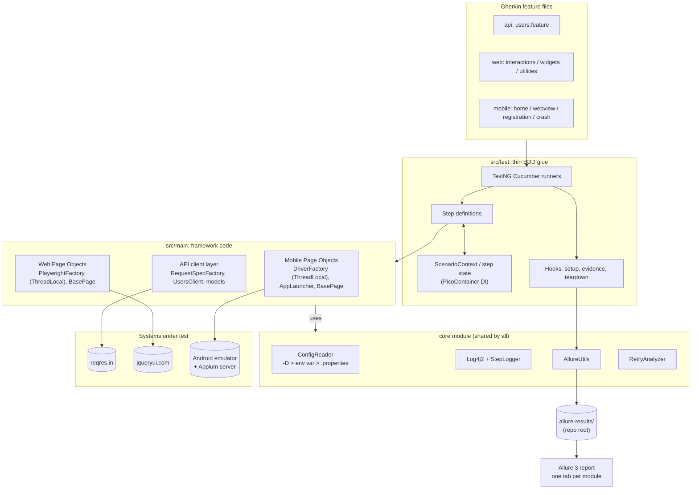

# SDET Evaluation Framework

[](https://github.com/alaasayedrashed/sdet-evaluation/actions/workflows/api-web-tests.yml)
[](https://github.com/alaasayedrashed/sdet-evaluation/actions/workflows/mobile-tests.yml)
[](https://github.com/alaasayedrashed/sdet-evaluation/actions/workflows/allure-report.yml)

**Live Allure report (latest `main`):** https://alaasayedrashed.github.io/sdet-evaluation/

One Maven multi-module repository that automates three kinds of testing with the same stack
(Cucumber BDD on TestNG, Allure reporting, SLF4J/Log4j2 logging):

| Module | Tool | Application under test | Scenarios |
|---|---|---|---|
| `api-tests` | REST Assured | [reqres.in](https://reqres.in) | 2 task cases (4 scenarios incl. outline rows) |
| `web-tests` | Playwright for Java | [jqueryui.com](https://jqueryui.com) | 7 task cases (8 scenarios) |
| `mobile-tests` | Appium (UiAutomator2) | `selendroid-test-app` on an Android emulator | 9 task cases (2 are intentional failures) |
| `core` | - | shared framework code used by all modules | 16 unit tests |

---

## Contents

1. [Tech stack](#tech-stack)
2. [Architecture](#architecture)
3. [Prerequisites](#prerequisites)
4. [Running the tests](#running-the-tests)
5. [Reporting](#reporting)
6. [CI/CD](#cicd)
7. [Scenario coverage](#scenario-coverage)
8. [Assumptions and notes](#assumptions-and-notes)
9. [Design decisions](#design-decisions)
10. [Java 21 features used](#java-21-features-used)
11. [Requirements → evidence](#requirements--evidence)
12. [What I would add next](#what-i-would-add-next)

---

## Tech stack

All versions are managed once in the parent [`pom.xml`](pom.xml) (`<properties>` + `<dependencyManagement>` / `<pluginManagement>`); child POMs declare dependencies without versions. Each was the latest stable release on Maven Central at the time of writing.

| Area | Library / tool | Version |
|---|---|---|
| Language | Java (Temurin) | **21 LTS** |
| Build | Maven (via wrapper `./mvnw`) | 3.10.0 |
| Test runner | TestNG | 7.12.0 |
| BDD | Cucumber (`cucumber-java`, `-testng`, `-picocontainer`) | 7.34.9 |
| Mobile | Appium java-client / Selenium | 10.1.1 / 4.50.0 |
| Mobile server | Appium server / UiAutomator2 driver | 3.8.0 / 8.7.0 |
| Web | Playwright for Java | 1.63.0 |
| API | REST Assured + json-schema-validator | 6.0.1 |
| JSON | Jackson | 2.22.3 |
| Assertions | AssertJ | 3.27.7 |
| Reporting | Allure Java (`allure-cucumber7-jvm`, `allure-rest-assured`) | 3.0.0 |
| Report CLI | Allure 3 (npm, run through `npx`) | 3.20.1 |
| Logging | SLF4J / Log4j2 | 2.0.20 / 2.26.1 |
| Boilerplate | Lombok | 1.18.48 |
| Step capture | AspectJ weaver (`-javaagent`) | 1.9.25.1 |

Why Cucumber **7** and not 8: Cucumber 8 exists, but Allure has no Cucumber 8 adapter yet (only `allure-cucumber7-jvm`).

---

## Architecture



### Repository layout

```
sdet-evaluation/
├── pom.xml                  parent: modules, versions, enforcer, surefire + AspectJ agent, Allure goals
├── allurerc.mjs             Allure 3 report config: per-module environments, categories, variables
├── core/                    ConfigReader, StepLogger, AllureUtils, utils, RetryAnalyzer, log4j2.xml
├── api-tests/               client/ (RequestSpecFactory, UsersClient), models/ (POJOs + record)
├── web-tests/               driver/ (PlaywrightFactory), pages/ (+ components/RentalCarForm)
├── mobile-tests/            driver/ (DriverFactory, AppLauncher, ScreenCapture), pages/, models/
│   └── src/test/resources/apps/selendroid-test-app.apk
└── .github/
    ├── workflows/           api-web-tests.yml, mobile-tests.yml, allure-report.yml
    └── scripts/             run-mobile-tests.sh
```

Every test module follows the same layout: framework code (drivers, page objects, clients, models, config) in `src/main`, and BDD glue (runners, steps, hooks, features, `config/*.properties`) in `src/test`.

### Patterns and why they are used

| Pattern | Where | Why |
|---|---|---|
| **Page Object Model** | `web-tests/.../pages`, `mobile-tests/.../pages` | Locators and interactions live in one class per screen; step definitions stay readable and never touch locators. |
| **Component object** | `web-tests/.../pages/components/RentalCarForm` | The Controlgroup demo shows the same form twice (horizontal + vertical); one component serves both. |
| **API client layer + POJOs** | `api-tests/.../client`, `.../models` | Steps call `usersClient.getUsers(2)` instead of building requests; JSON maps to typed models. |
| **Factory + `ThreadLocal`** | `PlaywrightFactory`, `DriverFactory` | Each thread owns its browser/driver, so the code is parallel-safe even though mobile runs sequentially. |
| **Dependency injection (PicoContainer)** | step and hook constructors | Page objects, clients and `ScenarioContext` are injected per scenario, with no static mutable state. |
| **`ScenarioContext` (API chaining)** | `api-tests/.../context/ScenarioContext` | Carries the GET response and the selected user into the POST step, with typed fields. |
| **Layered configuration** | `core/.../config/ConfigReader` | No hardcoded URLs, credentials, timeouts or devices. Each key is resolved in the order `-Dkey` → environment variable (`WEB_HEADLESS`) → `config/<module>.properties`. |
| **Hooks for evidence** | `ApiHooks`, `WebHooks`, `MobileHooks` | Setup/teardown and failure evidence (screenshots, page source/HTML, logcat, traces) are kept out of the steps. |
| **Builder** | `CreateUserRequest` (Lombok `@Builder` on a record) | The POST body is built from the GET response, not by string concatenation. |
| **Retry strategy** | `core/.../testng/RetryAnalyzer` + `RetryListener` | Configurable flakiness strategy: `-Dretry.count=N`, default 0. CI uses 1 for the emulator only. |

### Waits and stability

- **Explicit waits only.** There is no `Thread.sleep` in the codebase.
  - Web: Playwright's auto-waiting with configured timeouts.
  - Mobile: `WebDriverWait` / `FluentWait`, for example an *invisibility* wait for the progress loader and a 100 ms polling wait for the short-lived toast.
- **Assertions** use AssertJ with descriptive messages (`.as("...")`). The Controlgroup form uses soft assertions, so all its fields are checked at once.
- **Exception handling.** Evidence capture never throws: every screenshot, page source or logcat capture is isolated in its own `try/catch`. Configuration errors fail fast with a message that names the missing key and how to set it.

---

## Prerequisites

| Needed for | Requirement |
|---|---|
| Everything | **JDK 21**, the LTS release fully supported by every library in the stack. The enforcer stops the build with a clear message on an older JDK. `.java-version` and `.sdkmanrc` pin Temurin 21. |
| Everything | **No Maven install needed**: use the bundled wrapper `./mvnw` (Windows: `mvnw.cmd`). |
| Report | **Node.js 18+** (22 used). The Allure 3 CLI runs through `npx`; nothing to install globally. |
| Web | Nothing extra. Playwright downloads its browsers on first run. |
| Mobile | **Appium server 3.8.0** + **UiAutomator2 driver 8.7.0**: `npm i -g appium@3.8.0 && appium driver install uiautomator2@8.7.0` |
| Mobile | **Android SDK** with `ANDROID_HOME` set, and an emulator on **API 30 (Android 11)**, Google APIs, x86_64. See [old-app caveats](#mobile-selendroid-test-app). |

<details>
<summary>Mobile setup checklist (one-time)</summary>

1. Install the Android SDK (Android Studio or `cmdline-tools`) and set `ANDROID_HOME` (Windows: `%LOCALAPPDATA%\Android\Sdk`).
2. Install the API 30 image and create an AVD:
   ```bash
   sdkmanager "system-images;android-30;google_apis;x86_64"
   avdmanager create avd -n sdet_api30 -k "system-images;android-30;google_apis;x86_64" -d pixel_5
   emulator -avd sdet_api30
   ```
3. Install Appium and the driver (versions above), then start the server with chromedriver autodownload (needed for the WebView scenario):
   ```bash
   appium --allow-insecure "*:chromedriver_autodownload"
   ```
4. Check that the device is visible with `adb devices`. If several devices are connected, select one with `-Dmobile.udid=emulator-5556`.

The APK is committed at `mobile-tests/src/test/resources/apps/` and installed by Appium on the first session.
</details>

---

## Running the tests

```bash
# Everything: core unit tests + API + web + mobile (mobile needs Appium + an emulator)
./mvnw clean test

# Everything except mobile (no Android tooling needed)
./mvnw clean test -pl '!mobile-tests'

# One module (-am also builds core)
./mvnw clean test -pl api-tests -am
./mvnw clean test -pl web-tests -am
./mvnw clean test -pl mobile-tests -am

# By tag (overrides each runner's default tag filter)
./mvnw test -Dcucumber.filter.tags="@smoke"
./mvnw test -pl web-tests -Dcucumber.filter.tags="@web_case4"
./mvnw test -pl mobile-tests -Dcucumber.filter.tags="@mobile_sc3"

# Mobile intentional failures (scenarios 8 and 9) - expected to fail
./mvnw test -pl mobile-tests -Dcucumber.filter.tags="@negative"
# All 9 mobile scenarios in one run
./mvnw test -pl mobile-tests -Dcucumber.filter.tags="@mobile"
```

### Useful overrides

Every key in `config/*.properties` can be overridden with `-D` or an environment variable (dots → underscores, upper-case):

| Purpose | Example |
|---|---|
| Watch the browser (headed, slowed down) | `-Dweb.headless=false -Dweb.slow.mo=500ms` |
| Another browser | `-Dweb.browser=firefox` (chromium, firefox, webkit) |
| Pick a device | `-Dmobile.udid=emulator-5556` or `MOBILE_UDID=emulator-5556` |
| Remote Appium server | `-Dmobile.appium.url=http://host:4723` |
| Retry failed scenarios | `-Dretry.count=1` |
| Send requests without the API key | `-Dapi.key.enabled=false` |

### Tags

| Tag | Meaning |
|---|---|
| `@api` `@web` `@mobile` | Module; each runner's default filter |
| `@smoke` | Fast critical path: 2 scenarios per module |
| `@negative` | Mobile scenarios 8 and 9, which fail by design; excluded from the default mobile run |
| `@api_case1..2`, `@web_case1..7`, `@mobile_sc1..9` | One tag per task scenario |
| `@screenshots` | Take a screenshot after every step (used on 4 key flows) |

---

## Reporting

Every module writes Allure results to **one** folder at the repository root (`./allure-results`), so the report is combined automatically.

```bash
./mvnw -N exec:exec@allure-report    # builds ./allure-report
./mvnw -N exec:exec@allure-serve     # opens it in the browser
```

What the report contains:

- **One tab ("environment") per module**: API (REST Assured), Web (Playwright), Mobile (Appium). Tests are routed by their Cucumber tag in [`allurerc.mjs`](allurerc.mjs).
- **Failure categories**:
  - *Intentional failures (app crash demo)*
  - *Product defects (assertion failed)*
  - *Test or environment errors* (timeouts, driver, network)
- **Variables**: Java version, test stack, branch, commit, and a link to the CI run.
- **Evidence**:

  | Module | Every scenario | On failure |
  |---|---|---|
  | API | each request/response as an HTTP exchange (`AllureRestAssured` filter) | last response status and body |
  | Web | final full-page screenshot | screenshot, URL, page HTML, Playwright trace zip (open at [trace.playwright.dev](https://trace.playwright.dev)) |
  | Mobile | final device screenshot | screenshot, app state, page source, last 200 logcat lines |

  Page-object methods annotated with `@Step` appear as nested steps (AspectJ weaving), so a Cucumber step expands into the actions it performed.

### Screenshots

> _Placeholders: add the images under `docs/images/` and replace these lines._

- `docs/images/allure-overview.png`: overview with the three module tabs
- `docs/images/allure-api-chaining.png`: API chaining scenario with the HTTP exchanges
- `docs/images/allure-web-sortable.png`: web scenario with step screenshots
- `docs/images/allure-mobile-crash.png`: intentional failure with screenshot, page source and logcat

---

## CI/CD

| Workflow | Trigger | What it does |
|---|---|---|
| [`api-web-tests.yml`](.github/workflows/api-web-tests.yml) | push, pull request, manual | Temurin 21 + Maven cache, cached Playwright Chromium (`install --with-deps`), headless API + web tests. Always uploads `allure-results` and the HTML report; uploads traces and logs on failure. |
| [`mobile-tests.yml`](.github/workflows/mobile-tests.yml) | push, pull request, manual | KVM-enabled Ubuntu, cached API 30 AVD snapshot, Appium 3.8.0 + UiAutomator2 8.7.0, then runs [`run-mobile-tests.sh`](.github/scripts/run-mobile-tests.sh) on the emulator. Always uploads results, the Appium log and framework logs. |
| [`allure-report.yml`](.github/workflows/allure-report.yml) | after either test workflow finishes on `main`, or manual | Waits until results from **both** workflows exist for the same commit, merges them into one Allure report and deploys it to **GitHub Pages**. |

**Expected failures in CI.** The mobile script runs the regular scenarios first; their result decides the job status. It then runs `@negative`, whose failure is reported but does not fail the job. Both outcomes are written to the job summary:

| Suite | Expectation | Outcome |
|---|---|---|
| Regular scenarios (1-7) | pass | passed |
| Intentional crashes (8-9, `@negative`) | fail by design | failed as expected |

I chose this over a separate `continue-on-error` step because a second step would boot the emulator a second time.

Other CI choices:
- Runners are pinned to `ubuntu-24.04`, because GitHub moves `ubuntu-latest` to Ubuntu 26 in October 2026.
- The emulator step has its own time limit.
- The CI script always stops Appium, so the emulator can shut down cleanly.

---

## Scenario coverage

### API: reqres.in ([`users.feature`](api-tests/src/test/resources/features/users.feature))

| # | Task scenario | Tag | Status |
|---|---|---|---|
| 1 | `GET /api/users?page=2`: status 200; user `id 10` has `first_name` "Byron" (POJO deserialization) | `@api_case1` (Scenario Outline, task row tagged `@smoke`; also checks ids 7 and 12) | ✅ |
| 2 | `POST /api/users` built from the GET result (chaining via `ScenarioContext`): status 201, non-empty `id`, `name`/`job` echoed, JSON schema matches, `createdAt` is a valid ISO timestamp | `@api_case2` `@smoke` | ✅ |

### Web: jqueryui.com ([`interactions`](web-tests/src/test/resources/features/interactions.feature), [`widgets`](web-tests/src/test/resources/features/widgets.feature), [`utilities`](web-tests/src/test/resources/features/utilities.feature))

| # | Task scenario | Tag | Status |
|---|---|---|---|
| 1 | Droppable: drag onto the target → "Dropped!" and `ui-state-highlight` class | `@web_case1` `@smoke` | ✅ |
| 2 | Selectable: Ctrl/Cmd+click Items 1, 3, 7 → exactly those three have `ui-selected` | `@web_case2` | ✅ |
| 3 | Controlgroup: fill and verify both the horizontal and vertical forms (see [assumption](#web-jqueryuicom)) | `@web_case3` (Scenario Outline) | ✅ |
| 4 | Datepicker: today (computed at run time) is highlighted and picked; input shows `MM/dd/yyyy` | `@web_case4` `@smoke` | ✅ |
| 5 | Resizable: drag the bottom-right handle by 120×80 → size grows by that amount, ±5 px | `@web_case5` | ✅ |
| 6 | Sortable: real mouse drags reorder Items 1..7 to 7..1 | `@web_case6` | ✅ |
| 7 | Widget Factory: "Go green" → computed `background-color` is `rgb(64, 250, 8)` | `@web_case7` | ✅ |

### Mobile: selendroid-test-app ([`home`](mobile-tests/src/test/resources/features/home.feature), [`webview`](mobile-tests/src/test/resources/features/webview.feature), [`registration`](mobile-tests/src/test/resources/features/registration.feature), [`crash`](mobile-tests/src/test/resources/features/crash.feature))

| # | Task scenario | Tag | Status |
|---|---|---|---|
| 1 | Launch → title → key home elements displayed | `@mobile_sc1` `@smoke` | ✅ |
| 2 | EN Button → "No, no" → home screen displayed | `@mobile_sc2` | ✅ |
| 3 | Chrome logo → WebView: greeting text → name + "Mercedes" → "This is my way of saying hello" with name and car echoed → "here" → default car "Volvo" | `@mobile_sc3` | ✅ |
| 4 | File logo → welcome text, form elements, "Mr. Burns" and "Ruby" defaults → fill all fields + "I accept adds" → confirmation matches → back to home | `@mobile_sc4` `@smoke` | ✅ |
| 5 | Progress bar → explicit invisibility wait for the loader → registration form elements | `@mobile_sc5` | ✅ |
| 6 | Toast text "Hello selendroid toast!" | `@mobile_sc6` | ✅ |
| 7 | Popup window → Dismiss → popup gone | `@mobile_sc7` | ✅ |
| 8 | Press the exception button → verify the home title | `@mobile_sc8` `@negative` | ❌ **fails by design** |
| 9 | Type `test` into the exception field → verify the home title | `@mobile_sc9` `@negative` | ❌ **fails by design** |

---

## Assumptions and notes

### API: reqres.in
- **API key.** On 2026-10-07 the public endpoints answered the same with or without the `x-api-key` header. The suite sends the documented free key `reqres-free-v1` anyway (from `api.properties`, through the shared request spec), so it keeps working if the key becomes mandatory again. Turn it off with `-Dapi.key.enabled=false`.
- **Extra `_meta` field.** reqres.in adds a `_meta` object to every response. Unknown fields are ignored when mapping to models, and the JSON schema allows extra properties, so the contract only pins the fields the tests rely on.
- **Job title.** The POST body's `job` value comes from the feature file; `name` comes from the GET response.

### Web: jqueryui.com
- **Sidebar sections.** The task lists Resizable, Sortable and Widget Factory under *Widgets*. On jqueryui.com, Resizable and Sortable are under **Interactions** and Widget Factory is under **Utilities**. Navigation uses the real sections, through the sidebar (`HomePage.openDemo(section, name)`), as the task requires.
- **Controlgroup assumption.** The task text is cut off and names no actions. In **both** the horizontal and the vertical form, the scenario:
  1. selects a car type through the selectmenu,
  2. selects the "Automatic" transmission,
  3. checks "Insurance",
  4. sets the number of cars to 2 using the spinner arrows,
  5. clicks "Book Now!",
  6. then verifies every control kept its state.

  This assumption is also written as a comment in the feature file.
- **Demo iframe.** Every demo renders in `iframe.demo-frame`, and all interactions go through `BasePage.demoFrame()`.
- **Drag operations.** Droppable, Resizable and Sortable use mouse down → move in several steps → up, because jQuery UI needs real `mousemove` events.

### Mobile: selendroid-test-app
- **Emulator: API 30 (Android 11).** The committed APK reports version `0.12.0-SNAPSHOT` (the task brief refers to it as 0.17.0) and targets **SDK 10**. Android 14+ refuses to install it (`INSTALL_FAILED_DEPRECATED_SDK_VERSION`), so API 30 is used, locally and in CI.
- **Old-app system screens.** After a fresh install, Android shows a *legacy permission review* and then an *"app built for an older version of Android"* warning before the app opens. Permissions are granted at install (`autoGrantPermissions`), and `AppLauncher` dismisses any remaining system screen, plus any leftover crash dialog, with one short explicit wait.
- **App reset.** One Appium session is shared by all scenarios. Before each scenario the app is terminated and relaunched, which also recovers from a crash. A dead session is recreated automatically.
- **WebView.**
  - The page is served by an HTTP server inside the app (`localhost:4450`).
  - `switchToWebView()` logs the available contexts (for example `[NATIVE_APP, WEBVIEW_io.selendroid.testapp]`) before switching.
  - Chromedriver is downloaded automatically. In Appium 3 that's enabled with the server flag `--allow-insecure "*:chromedriver_autodownload"`; there is no `chromedriverAutodownload` capability.
  - Web locators are CSS only, because Chromedriver rejects the `id`/`name` locator strategies the Appium client sends.
  - The greeting is plain page text, not a heading, so it's verified as page text.
- **Toast.** A toast lives about 2 s, and UiAutomator2 exposes it only briefly. The text is extracted from page-source polls taken every 100 ms, which avoids the race between finding the element and reading it.
- **Intentional failures (scenarios 8 and 9).** These fail **on purpose**: the app crashes, so the home title can't be verified. They demonstrate failure reporting:
  - **Message:** `Expected the home screen with title 'selendroid-test-app', but the app is NOT_RUNNING - it most likely crashed`.
  - **Allure category:** *Intentional failures*.
  - **Attachments:** a screenshot, the app state, the page source, and logcat containing `FATAL EXCEPTION: main … RuntimeException: Unhandled Exception Test!`.
  - **Recovery:** the next scenario relaunches the app, and the rest of the suite still passes.

---

## Design decisions

| Decision | Reasoning |
|---|---|
| Framework code in each module's `src/main`, glue in `src/test` | Page objects and clients are reusable outside Cucumber and are compiled separately from the steps. |
| One `log4j2.xml` in `core` instead of one per module | Avoids copying the same file three times. Surefire passes `module.name`, so each module still logs to `<module>/target/logs/<module>.log`. |
| A fresh Playwright stack per scenario | Full isolation (cookies, storage, dialogs) and simple teardown, at the cost of about 1 s per scenario. |
| One Appium session reused, app relaunched per scenario | Starting a session costs 10–20 s; relaunching the app gives the same clean state faster. |
| Allure 3 report CLI (through Maven `exec`) | It renders Allure 3's HTTP-exchange attachments, splits the report per module, and can merge CI artifacts. |
| `allure-testng` not on the Cucumber modules' classpath | The Cucumber adapter already reports each scenario; adding TestNG's adapter would report every scenario twice. |
| `dependencyConvergence` enforced, with explicit pins for transitive conflicts | A deterministic classpath. The pins are grouped and commented in the parent POM. |
| Per-step screenshots only on scenarios tagged `@screenshots` | Shows the key flows step by step without adding noise to every scenario. |
| Mobile screenshots always taken in the native context | Inside a WebView, screenshots go through Chromedriver, are slow, and only show the web part. |

---

## Java 21 features used

| Feature | Where |
|---|---|
| **Records** | `CreateUserRequest` (immutable request body, with Lombok `@Builder`), `UserRegistration` (mobile form data compared across steps), `WidgetsSteps.RentalCarBooking` (Gherkin table row), `ResizablePage.Size`, web `BasePage.Point`, `AppLauncher.SystemScreen` |
| **Text blocks** | `UserModelsMappingTest`: realistic reqres.in JSON for an offline mapping test |
| **Switch expressions** | `ConfigReader` (boolean and duration parsing), `PlaywrightFactory.browserType()` |
| **`var`, `String.formatted`, `Stream.toList()`, `Optional.or`** | Throughout, where the type is obvious |

Response models stay plain Lombok classes (`@Data`), because Jackson binding with setters is clearer there than records.

---

## Requirements → evidence

| Requirement | Evidence |
|---|---|
| One Git repo, multi-module Maven | [`pom.xml`](pom.xml): modules `core`, `api-tests`, `web-tests`, `mobile-tests` |
| Mobile: Appium (Java client, UiAutomator2, emulator) | [`DriverFactory`](mobile-tests/src/main/java/com/sdet/evaluation/mobile/driver/DriverFactory.java) (`UiAutomator2Options`), API 30 emulator locally and in CI |
| Web: Playwright for Java (separate module) | [`web-tests`](web-tests), [`PlaywrightFactory`](web-tests/src/main/java/com/sdet/evaluation/web/driver/PlaywrightFactory.java) |
| API: REST Assured | [`api-tests`](api-tests), [`RequestSpecFactory`](api-tests/src/main/java/com/sdet/evaluation/api/client/RequestSpecFactory.java), [`UsersClient`](api-tests/src/main/java/com/sdet/evaluation/api/client/UsersClient.java) |
| TestNG in all modules | `AbstractTestNGCucumberTests` runners; TestNG `IRetryAnalyzer`; `core` unit tests |
| Cucumber BDD (Gherkin) in all modules | `src/test/resources/features/*.feature` in every test module |
| Allure reporting, combined across modules | Root `allure-results`, [`allurerc.mjs`](allurerc.mjs), `exec:exec@allure-report`, [live report](https://alaasayedrashed.github.io/sdet-evaluation/) |
| POM for mobile and web; client layer + POJOs for API | `pages/` packages (+ `components/`); `client/` + `models/` |
| Clean code: structure and naming | Same layout in every module; framework code in `src/main` with Javadoc on public framework methods; steps contain no logic |
| Logging (SLF4J + Log4j2) | [`log4j2.xml`](core/src/main/resources/log4j2.xml), [`StepLogger`](core/src/main/java/com/sdet/evaluation/core/logging/StepLogger.java), `Slf4jLoggingFilter` for HTTP |
| Meaningful assertions | AssertJ `.as(...)` messages in every step class; soft assertions for multi-field checks |
| Exception handling | Defensive evidence capture in all hooks, crash-tolerant typing (`HomePage.typeIntoCrashField`), fail-fast `ConfigurationException` |
| Explicit waits only, no `Thread.sleep` | `BasePage` wait helpers, `FluentWait` for the toast, invisibility wait for the loader. A search for `Thread.sleep` finds nothing. |
| Screenshots on failure and on key steps, for web and mobile | `WebHooks` / `MobileHooks` (`@After` and `@AfterStep("@screenshots")`), [`ScreenCapture`](mobile-tests/src/main/java/com/sdet/evaluation/mobile/driver/ScreenCapture.java) |
| Runs through Maven and generates the Allure report | `./mvnw clean test` → `./mvnw -N exec:exec@allure-report` |
| GitHub Actions CI (`.yml`) | [`.github/workflows`](.github/workflows): 3 workflows, all green on `main` |
| Java 21 + enforcer + wrapper | `maven.compiler.release=21`; enforcer `requireJavaVersion [21,)`, `requireMavenVersion [3.9,)`, `dependencyConvergence`; `mvnw` / `.mvn/wrapper` |
| Lombok ≥ 1.18.40, AspectJ ≥ 1.9.25.1 | 1.18.48 and 1.9.25.1 |
| No hardcoded URLs, credentials, timeouts or test data | `config/*.properties` with `-D`/env overrides; test data in feature files |
| Tags, hooks, PicoContainer DI, Scenario Outlines, data tables, retry, `ThreadLocal` | See [Tags](#tags) and [Patterns](#patterns-and-why-they-are-used) |
| Demo-able and explainable | `-Dweb.headless=false -Dweb.slow.mo=500ms` for a live web demo; this README |

---

## What I would add next

- **Docker** images for the web/API runs and an Appium + emulator container (e.g. `budtmo/docker-android`) for one-command local runs.
- **Cloud device farms** (BrowserStack / Sauce Labs) by switching `mobile.appium.url` and capabilities, to test on real devices and more Android versions.
- **Parallel execution**: the factories are already `ThreadLocal`; enable TestNG's parallel data provider for web/API, and add one emulator per thread for mobile.
- **Contract testing** (Pact) for API consumers, beyond the JSON schema.
- **Visual testing** (Playwright screenshot comparison or Applitools) for the jQuery UI widgets.
- **Report history** across CI runs (Allure 3 `historyPath` stored on the Pages branch), and Slack/Teams notifications from the report.
- **Static analysis** in CI (Checkstyle/Spotless, SpotBugs) and Dependabot for version updates.
